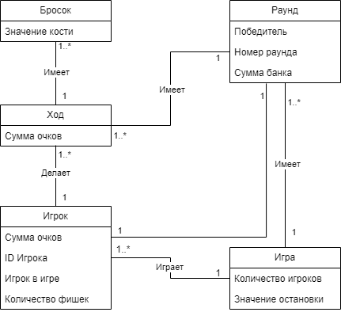



**Игрок - Игра**

- ID игрока генерируется автоматически
- Каждому игроку в начале каждой игры присваивается по 5 фишек
- Один или несколько игроков могут играть в одну игру

**Игрок - Ход**

- Ход хранит в себе суммарное количество очков полученных в результате бросков
- Каждый игрок совершает по одному ходу за раунд

**Игрок - Раунд**

- Раунд хранит в себе победителя, номер раунда и сумму фишек в банке
- Один конкретный игрок является победителем в одном конкретном раунде

**Игра - Раунд**

- Раунд хранит в себе победителя, номер раунда и сумму фишек в банке
- Одна конкретная игра имеет один или более раундов, но конкретный раунд имеется только в одной игре

**Раунд - Ход**

- Ход имеет сумму очков полученных в результате бросков
- Один раунд может иметь один или более ходов
- Конкретный ход имеется только в одном конкретном раунде

**Ход - Бросок**

- Бросок хранит в себе значение брошенной кости
- Один ход может иметь один или более бросков, но конкретный бросок имеется только в одном ходе
