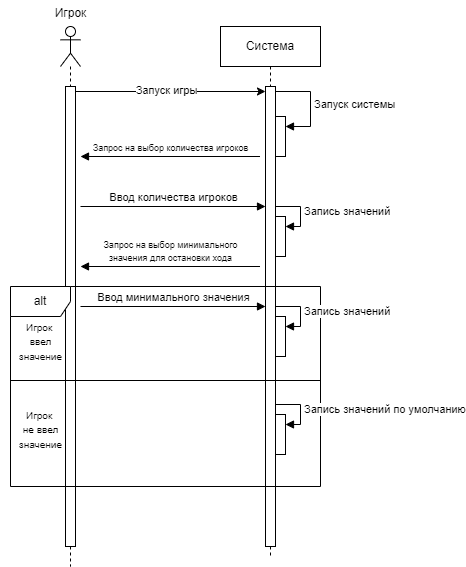
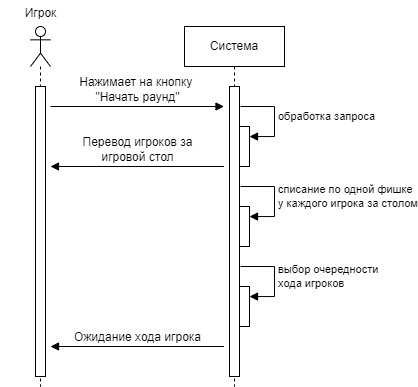
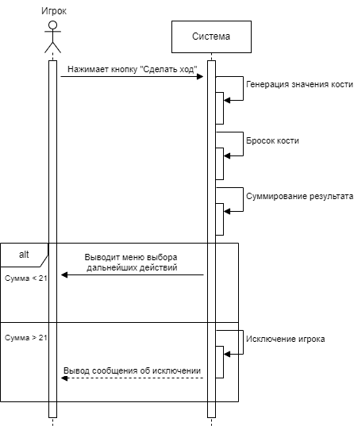
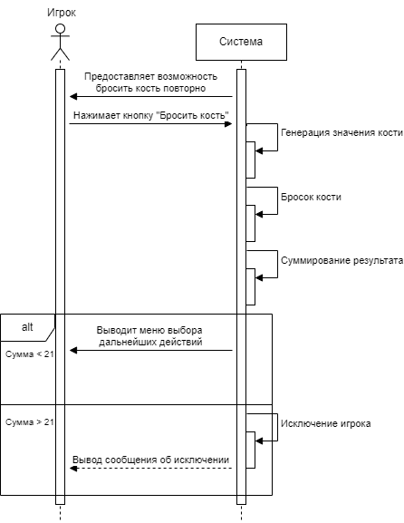
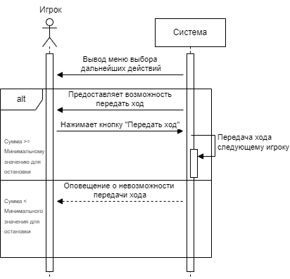

**Прецедент “Начать игру”**

|**Операция**|**Выбор количества игроков**|
| :-: | :-: |
|Ссылки|Прецедент: Начать игру|
|Предусловие|Игрок запустил игру|
|Постусловие|Отображение меню выбора количества игроков|

|**Операция**|**Выбор минимального значения** |
| :-: | :-: |
|Ссылки|Прецедент: Начать игру|
|Предусловие|Игрок выбрал количество игроков|
|Постусловие|Минимальное значение записано в систему|

**Прецедент “Начать раунд”**

|**Операция**|**Перевод игрока за игровой стол**|
| :-: | :-: |
|Ссылки|Прецедент: Начать раунд|
|Предусловие|В системе содержится информация о количестве игроков и минимальном значении|
|Постусловие|Перевод игрока за игровой стол|

**Прецедент “Сделать ход”**

|**Операция**|**Выполнение хода**|
| :-: | :-: |
|Ссылки|Прецедент: Сделать ход|
|Предусловие|Игрок находится за игровым столом|
|Постусловие|Ход игрока выполнен|

**Прецедент “Бросить кость повторно”**

|**Операция**|**Выполнение повторного броска**|
| :-: | :-: |
|Ссылки|Прецедент: Бросить кость повторно|
|Предусловие|Игрок находится в игре и сходил один и более раз|
|Постусловие|Ход игрока выполнен|

**Прецедент “Передать ход”**

|**Операция**|**Передача хода**|
| :-: | :-: |
|Ссылки|Прецедент: Передать ход|
|Предусловие|Игрок находится в игре и сходил один и более раз|
|Постусловие|Передача хода следующему игроку |

